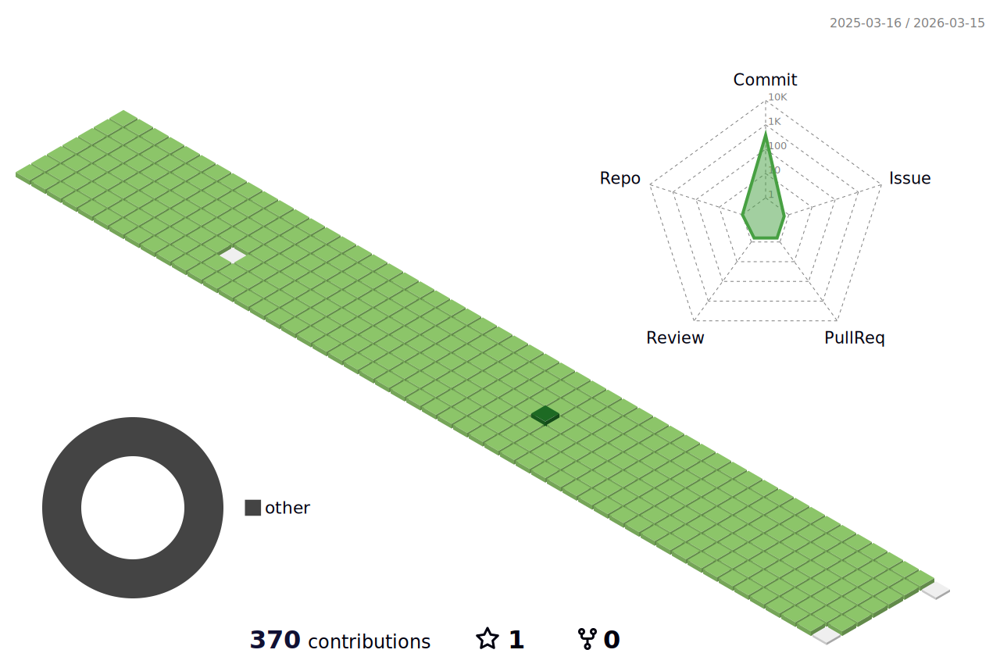
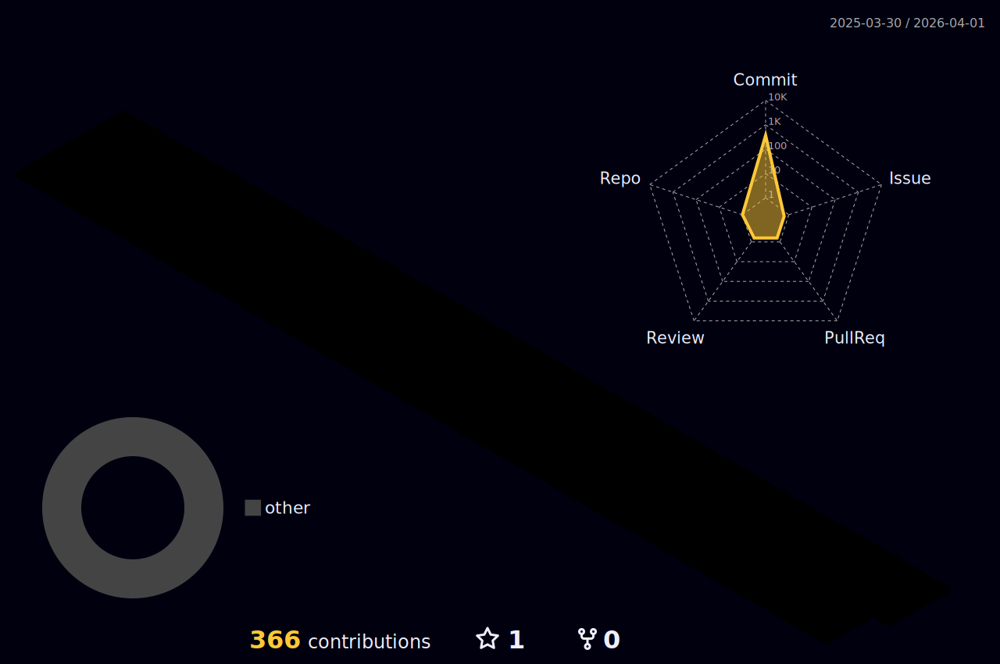

<!-- Header start -->
<!---->
<!---->

<!-- Header end -->

<!--### Hi I'M!! 👋-->
<!--
**jnj570244/jnj570244** is a ✨ _special_ ✨ repository because its `README.md` (this file) appears on your GitHub profile.

Here are some ideas to get you started:

- 🔭 I’m currently working on ...
- 🌱 I’m currently learning ...
- 👯 I’m looking to collaborate on ...
- 🤔 I’m looking for help with ...
- 💬 Ask me about ...
- 📫 How to reach me: ...
- 😄 Pronouns: ...
- ⚡ Fun fact: ...
-->

## 🌐 BLOG : 
 

  <!--뱃지, 로고 샘플 -->
  <!--
  
  
  -->
  <!--티스토리 블로그 뱃지 -->
  

## 🌐 ICON : 
 

  

  

  

   
  
  
  
   
  
  
  
  
  
  
  

<table>
  <tbody>
    <tr valign="top">
      <td width="25%" align="center">
        C#   
        
      </td>
      <td width="25%" align="center">
        C++   
        
      </td>
      <td width="25%" align="center">
        Python   
        
      </td>
      <td width="25%" align="center">
        Vulkan   
        
        
      </td>
    </tr>
  </tbody>
</table>

 
 
 
 
 

 
 
 
 
 
 
 
 
 
 
 
 
 
 
 
 
 
 
 
 

 
 

<!--GitHub Stats-->
## 📊 Github stats

  <!--Most Used Languages : 원형-->
  <!--
  
  -->
  <!--Most Used Languages : 컴팩트형-->
  <!--
      
  
  
  -->
  
  <a href="https://github.com/anuraghazra/github-readme-stats">
    <!--
    
    -->
    
  </a>
   
   
  <b>Note:</b> Top languages is only a metric of the languages my public code consists of and doesn't reflect experience or skill level.
   
   
  

<!--GitHub Stats-->

<!--GitHub-Profile-3D-Contrib-->
<!--

  

  

-->
<!--GitHub-Profile-3D-Contrib-->

<!-- Footer start -->
<!---->
<!---->

<!-- Footer end -->
